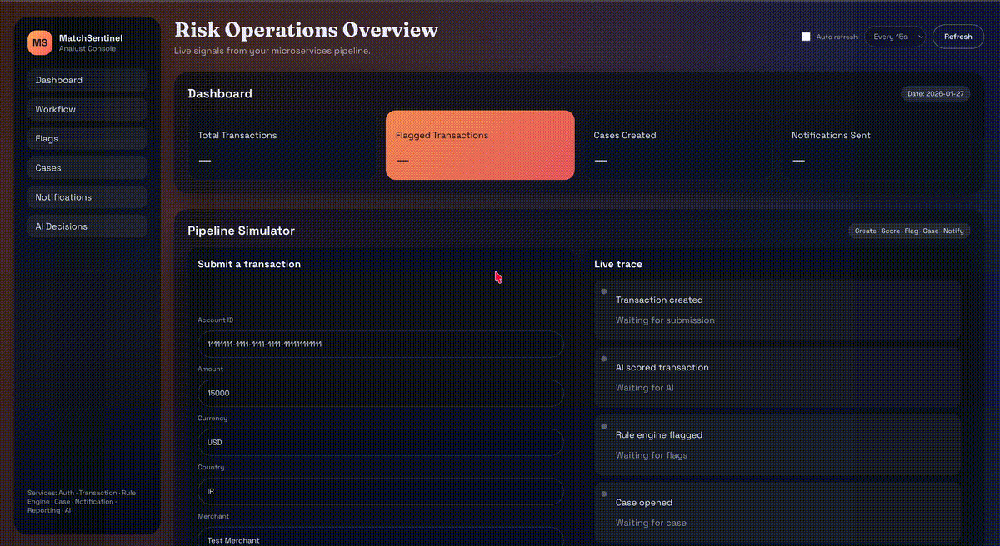

<!-- ⚠️ This README has been generated from the file(s) "blueprint.md" ⚠️-->

[](#-matchsentinel)

# ➤ MatchSentinel
### **Live Fraud Defense Platform**

**Transaction Intelligence → AI Risk Scoring → Rule Engine Flags → Case Ops → Notifications → Reporting**

Built as a production‑style, end‑to‑end system with Spring Boot microservices, RabbitMQ, PostgreSQL + Liquibase, and a cinematic React + Vite analyst dashboard.


<p align="center" width="100%">
  
[](#)
[](#)
[](#)
[](#)
[](#)
[](#)

</p>
</div>

<p align="center">
  
</p>

---


[](#-what-is-matchsentinel)

## ➤ ⚡ What is MatchSentinel?

MatchSentinel is a real, event‑driven fraud defense platform that **actually runs end‑to‑end**. It ingests transactions, scores risk, flags anomalies, opens cases, sends notifications, and rolls everything into daily reporting — all visible in a live analyst console.

---


[](#-why-it-stands-out)

## ➤ ✨ Why it stands out

- **Full pipeline**: Transaction → AI → Rule Engine → Case → Notification → Reporting
- **Event‑driven architecture** with RabbitMQ
- **Service‑level persistence** (Postgres + Liquibase per service)
- **Idempotent reporting updates** (safe with at‑least‑once delivery)
- **Live dashboard** with filters, drill‑downs, and pipeline simulator
- **Clean separation of concerns**, production‑style structure

---


[](#-design-decisions)

## ➤ 🧠 Design Decisions

| Decision | Why it matters |
|---|---|
| **RabbitMQ event bus** | Decouples services, enables async processing, and supports at‑least‑once delivery across the pipeline. |
| **Per‑service Postgres + Liquibase** | Keeps data ownership clear and migrations explicit. Each service evolves independently. |
| **Idempotent reporting updates** | Reporting safely handles retries and duplicate events — critical in real event‑driven systems. |
| **AI service isolated** | Scoring logic can evolve (heuristics → ML) without touching upstream services. |
| **Rule engine separated from AI** | Keeps deterministic policy rules distinct from probabilistic AI scoring. |

---


[](#-architecture-highlevel)

## ➤ 🏗️ Architecture (high‑level)


---


[](#-services)

## ➤ 🧩 Services

| Service | Port | Purpose |
|---|---:|---|
| Auth Service | 8081 | Authentication (foundation; UI integration pending) |
| Transaction Service | 8082 | Ingest transactions + publish events |
| Rule Engine Service | 8083 | Heuristic + AI‑driven flags |
| Case Service | 8084 | Case creation + assignment + status |
| Notification Service | 8085 | Sends notifications and stores audit trail |
| Reporting Service | 8086 | Daily rollups + idempotent event counters |
| AI Service | 8087 | Risk scoring (heuristic model v1) |

---


[](#-quickstart-docker)

## ➤ 🚀 Quickstart (Docker)

```bash
docker compose up -d --build
```

---


[](#-run-the-ui-live-dashboard)

## ➤ 🎛️ Run the UI (Live Dashboard)


```bash
cd ui
npm install
npm run dev
```

Open: **http://localhost:5173**

Ensure these env vars exist in `ui/.env`:

```
VITE_TRANSACTION_SERVICE_URL=http://localhost:8082
VITE_RULE_ENGINE_URL=http://localhost:8083
VITE_CASE_SERVICE_URL=http://localhost:8084
VITE_NOTIFICATION_SERVICE_URL=http://localhost:8085
VITE_REPORTING_SERVICE_URL=http://localhost:8086
VITE_AI_SERVICE_URL=http://localhost:8087
```

---


[](#-oneclick-demo-pipeline-simulator)

## ➤ ⚙️ One‑click demo (Pipeline Simulator)

In the UI, open **Pipeline Simulator** and click **Run Pipeline**.

Expected flow:

- Transaction created
- AI score generated
- Rule Engine flag created
- Case opened
- Notification sent
- Reporting counters updated

---


[](#-manual-smoke-test-api)

## ➤ 🔬 Manual smoke test (API)

```bash

# ➤ Create a transaction
curl -s -X POST http://localhost:8082/api/transactions \
  -H "Content-Type: application/json" \
  -d '{
    "accountId":"11111111-1111-1111-1111-111111111111",
    "amount":15000.00,
    "currency":"USD",
    "country":"IR",
    "merchant":"Test Merchant",
    "occurredAt":"2026-01-26T10:15:30Z"
  }' | jq .

# ➤ AI Decision
curl -s "http://localhost:8087/api/ai/decisions?transactionId=<TX_ID>" | jq .

# ➤ Flags
curl -s "http://localhost:8083/api/flags" | jq .

# ➤ Cases
curl -s "http://localhost:8084/api/cases" | jq .

# ➤ Notifications
curl -s "http://localhost:8085/api/notifications" | jq .

# ➤ Reporting
curl -s "http://localhost:8086/api/reports/daily?date=2026-01-26" | jq .
```

---


[](#-testing)

## ➤ 🧪 Testing

Each service supports unit + integration tests (Testcontainers for Postgres/RabbitMQ).

Example:
```bash
cd services/reporting-service
./mvnw -Pintegration-tests -Dtest=ReportingIntegrationTest test
```

---


[](#-ui-highlights)

## ➤ 🎨 UI Highlights

- Dark cinematic theme
- Pipeline simulator (full flow trigger)
- Filterable tables (flags, cases, notifications)
- Live detail drawer with case actions + AI insights
- Auto‑refresh toggle

---


[](#-tech-stack)

## ➤ 🧠 Tech Stack

- **Java 17** / Spring Boot 3.5.x
- **RabbitMQ** event bus
- **PostgreSQL + Liquibase** per service
- **Testcontainers** for integration tests
- **React + Vite + TypeScript** UI

---


[](#-whats-next-ideas)

## ➤ 🛣️ What’s next (ideas)

- Auth + RBAC integration in UI
- WebSocket streaming
- Persist case notes in backend
- Exportable reporting APIs
- Observability dashboards (Prometheus + Grafana)

---


[](#-license)

---

## ➤ Authors

- [Riad Mukhtarov](https://www.linkedin.com/in/riadmukhtarov/)

---
## ➤ License

[MIT](https://choosealicense.com/licenses/mit/)


